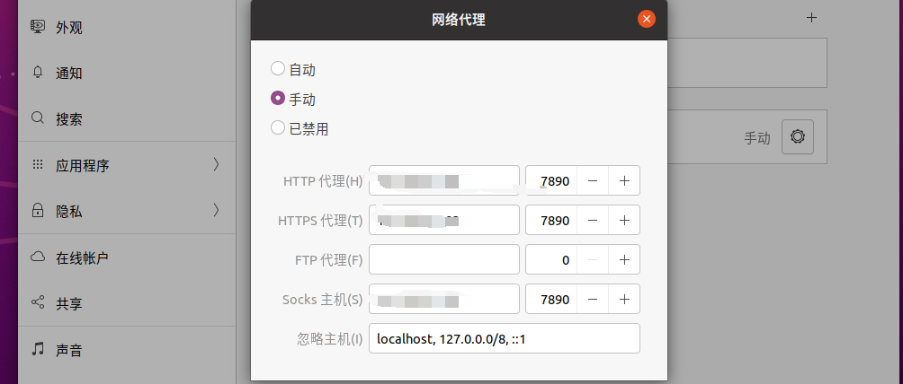

## windows下安装虚拟机配置

1. 安装界面太小，按 alt+f7 加鼠标滚轮调动

2. 换源

- 利用百度搜索  https://mirror.tuna.tsinghua.edu.cn/help/ubuntu ,使用下面的命令直接在终端执行  
- sudo apt-get update（更新）
- sudo apt-get upgrade（升级）

3. 虚拟机屏幕无法适应，其实就是安装vmware tools，可以手动，可以自动，自动如下（要先换源，不然那个维护软件包啥玩意的不让安装）：

```bash
sudo apt install open-vm-tools-desktop -y
sudo reboot
```

4. 虚拟机改代理，前面的数字为主机ipconfig下的ip



5. 虚拟机终端代理命令

```bash
git config --global https.proxy https://ip:7890
git config --global http.proxy http://ip:7890
```


