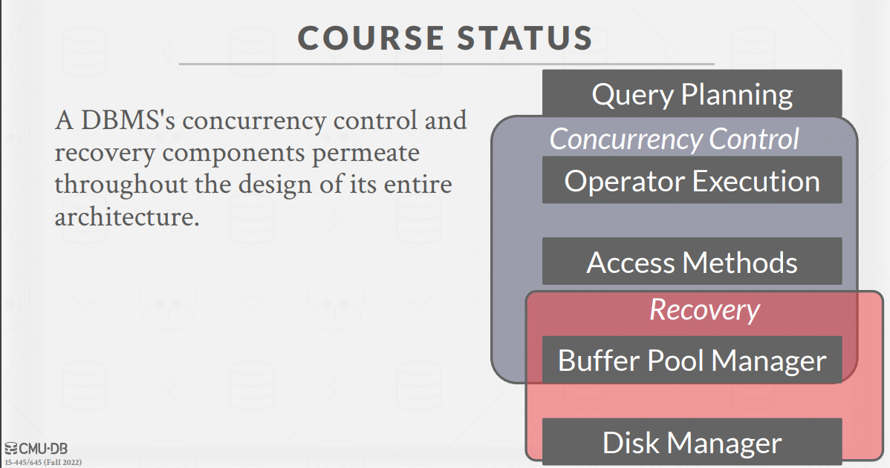
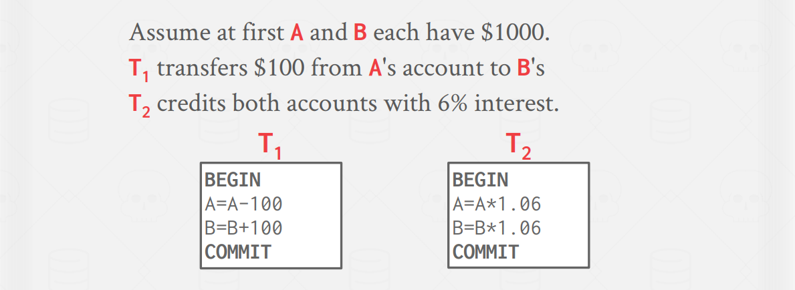
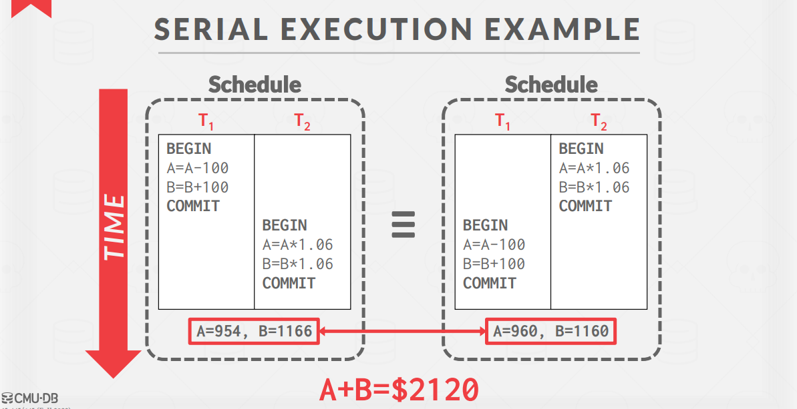
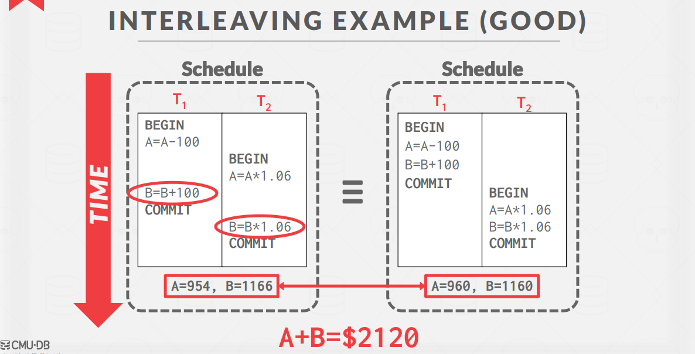
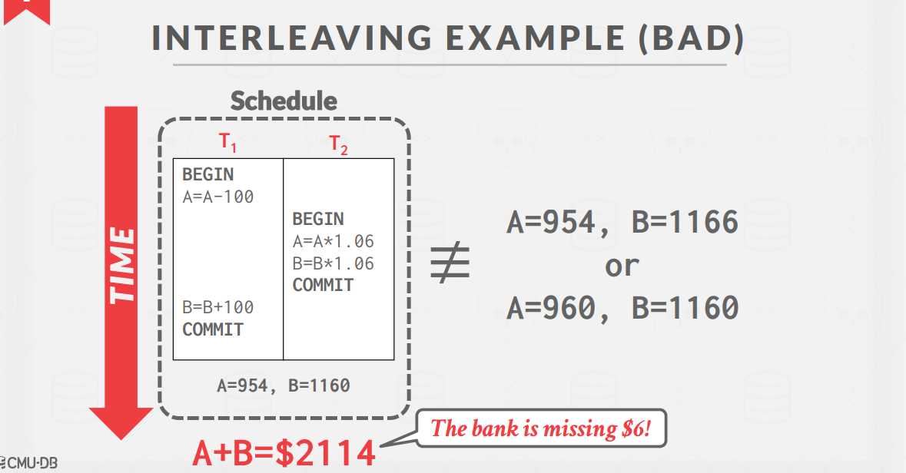
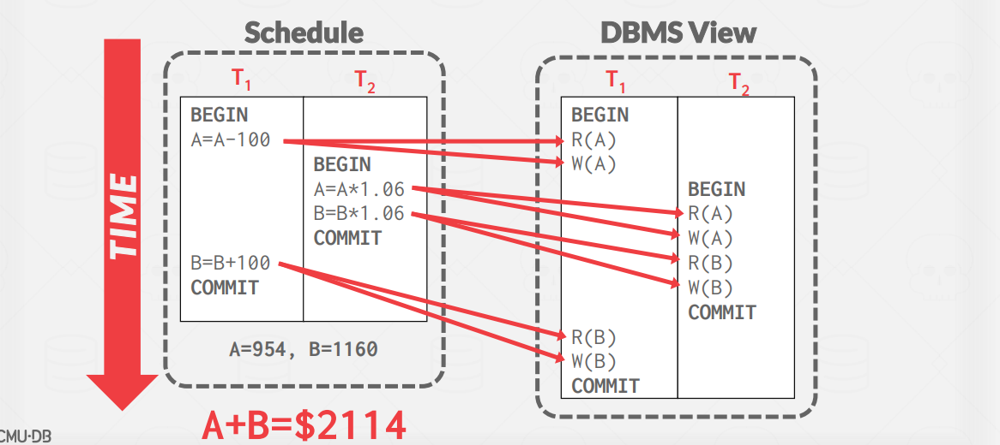

# Concurrency Control Theory

## 课程大纲

数据库的并发控制和恢复组件渗透在整个架构中。

## 目的

并发控制的一个情况：多个线程或者程序同时修改表的的一个记录

恢复的一个情况：从银行转账但是断电了

## 事务

并发控制和恢复它们都是 DBMS 宝贵的属性，他们都是基于事务的概念，事务具有 ACID 的特性，先来谈谈事务。

> A transaction is the execution of a sequence of one or more operations (e.g., SQL queries) on a database to perform some higher-level function.

事务是在数据库上执行一系列的一个或多个操作（例如 SQL 查询），以执行更高级的功能

在 DBMS 中，它是变化的基本单位，有些事务是不被允许执行的。（PS：事务的简写为 tnx ）

## 事务的例子

>Move $100 from Andy's bank account to his bookie's account. 
>
>Transaction:
>
>- Check whether Andy has $100.
>- Deduct $100 from his account.
>- Add $100 to his bookie's account

### 古老的系统

1. 当每个 txn 到达 DBMS 时，逐个执行(即串行顺序)，有一个且只能有一个 txn 在 DBMS 中同时运行。
2. 在 txn 启动之前，将整个数据库复制到一个新文件，并对该文件进行所有更改。

- 如果 txn 成功完成，则用新文件覆盖原文件。
- 如果 txn 失败，只需移除了那个修改过数据的脏副本。

### 问题陈述

一种可能更好的方法是允许独立事务并发执行。这样可以获得【更高的利用率和吞吐量】【减少用户响应时间】。但同时也需要保证【正确性】和【公平性】

任意的交错操作的执行顺序，可能会导致：

- 暂时的不一致（可以的，不可避免）
- 永久不一致（坏，不是想要的）

我们需要一个正确性标准来确定交错执行的顺序是否是正确的。

### 定义

txn 可以对从数据库检索到的数据执行许多操作。

而 DBMS 只关心从数据库中【读/写】什么数据，对“外部世界”的改变超出了 DBMS 的范围。例如，如果一个事务导致电子邮件被发送，那么如果该事务中止，发送邮件的这个事件也无法被回滚。

### 更为正式的定义

数据库：一组固定的命名数据对象集合（例如，A, B, C，…）

- 我们不需要知道这些对象是如何被定义的
- 下周我们会讨论如何处理插入和删除

事务：一组读和写的操作序列（R(A)， W(B)，…），这是 DBMS 对用户程序的抽象视图。

### SQL 中的事务

>A new txn starts with the **BEGIN** command. 
>
>The txn stops with either **COMMIT** or **ABORT**
>
>- If commit, the DBMS either saves all the txn's changes or aborts it.（或者提交或者放弃）
>-  If abort, all changes are undone so that it's like as if the txn never executed at all. （所有的改变都被撤销，就像从未执行）
>
>Abort can be either **self-inflicted** or caused by the **DBMS.**

### 正确性标准：ACID

**Atomicity**（原子性）：txn 中的所有操作都会发生，或者一个都不发生。

**Consistency**（一致性）：如果每个 txn 是一致的，并且 DB 开始时是一致的，并且最终也是一致的。

**Isolation**（隔离性）：一个 txn 的执行与其他 txn 的执行是隔离的。

**Durability**（持久性）：如果 txn 被提交，它的影响将持续存在。

#### 原子性

执行 txn 的两个可能结果：

- 完成所有操作后提交。
- 在执行一些操作后中止(或被DBMS中止)行动。

**DBMS** 保证 txns 是原子的：从用户的角度来看，txn 总是要么执行所有操作，要么根本不执行操作。

#### 确保原子性的机制

方法一：日志【Logging】

>DBMS logs all actions so that it can undo the actions of aborted transactions. （记录下所有的记录以便撤销）
>
>Maintain undo records both in memory and on disk. （磁盘和内存中都维护撤销的记录）
>
>Think of this like the black box in airplanes…（像一个飞机上的黑盒）

基本上每一个 DBMS 都在使用日志，【审计追踪】【效率的原因】

方法一：影子分页【Shadow Paging】

影子分页是一种[写时复制](https://zh.m.wikipedia.org/wiki/写时复制)技术，以避免[原地](https://zh.m.wikipedia.org/wiki/原地算法)修改页面。当一个页面将被修改，一个**影子页面**被分配。由于影子页面没有被别的地方引用，可以自由修改，不必顾虑一致性。当影子页面变得可以[持久](https://zh.m.wikipedia.org/wiki/持久性)，所有引用原页面的地方都被修改为引用影子页面。由于影子页面直到修改完毕（某个事务提交）才被激活，保证原子性。

起源于IBM System R，但很少有系统会这样做：【CouchDB】、【Tokyo Cabinet】、【LMDB (OpenLDAP)】

#### 一致性

在较高的层次上，一致性意味着数据库所代表的“世界”在**逻辑上**是正确的。应用程序询问的关于数据的所有问题(即查询)将返回逻辑正确的结果。有一致性的两个概念:

数据库一致性：

- 数据库准确地模拟真实世界，并遵循完整性约束（例如一个人的年龄不可能是负数）。
- tnx 在未来将看到在数据库中已经提交的事务的影响。

事务一致性：

- 如果数据库在事务启动前(单独运行)是一致的，那么在事务启动后它也将是一致的。
- 事务一致性是应用程序的责任。DBMS无法控制这一点，我们不再进一步讨论这个问题。

#### 隔离性

用户提交 txns，每个 txn 执行起来就像它自己运行一样。

但是 DBMS 通过打乱 txns 的操作(读/写数据库的对象)来实现并发。

们需要一种打乱 txn 的方法但仍然让它看起来像是以 **one-at-a-time ** 的形式在运行。

#### 确保隔离性的机制

**并发控制协议**是 DBMS 如何决定多个事务操作的适当交叉。

协议的两个种类

【悲观的】：一开始就不要让问题出现

【乐观的】：假设冲突发生的很少，在冲突发生后再进行处理。

两种串行的方式

交叉的执行方式

当一个 txn 因为资源(例如，page fault)，另一个 txn 可以继续执行

观察一些在 DBMS 视图中的样子

>**How do we judge whether a schedule is correct**? 
>
>If the schedule is **equivalent** to **some serial execution**.

#### 关于调度的一些属性

【串行调度】：不打乱 tnx 的执行顺序，即按某种次序串行执行。

【等价调度】：对于数据库任何状态，执行第一个操作的效果与执行第二个操作的效果相同。不在乎操作是什么！

【可串行化调度】：

>A schedule that is equivalent to some serial execution of the transactions.（等价于某个串行化调度）
>
>If each transaction preserves consistency, every serializable schedule preserves consistency（每个事务保持了一致性，每一个可串行化的调度也要保持一致性）

与 txn 启动时间或提交顺序相比，可序列化性是一个不那么直观的正确性概念，但它在调度操作方面为 DBMS 提供了更大的灵活性。而更大的灵活性意味着更好的并行性。

#### 冲突操作

