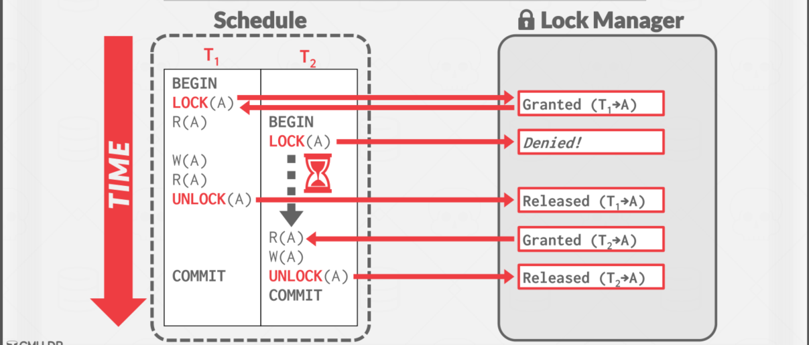
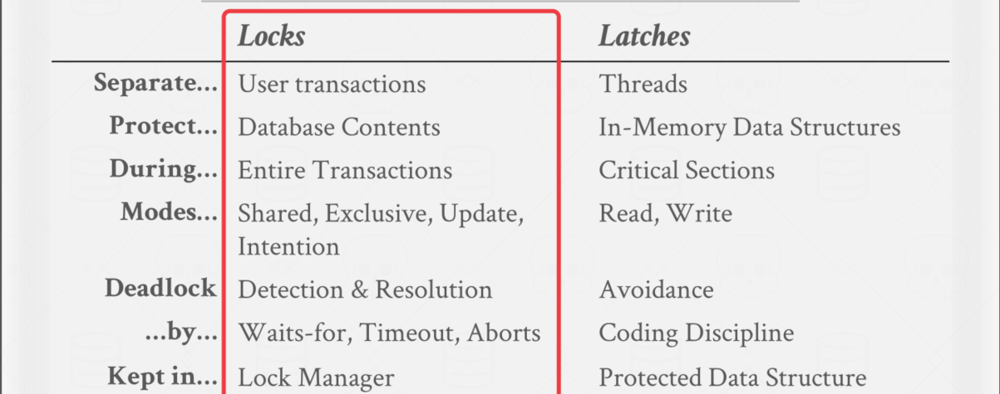
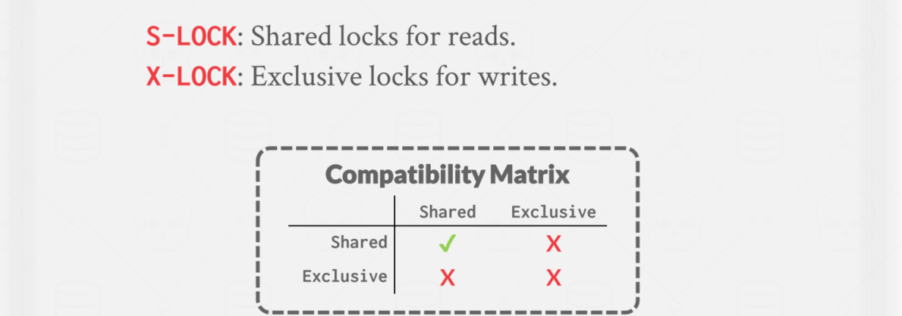
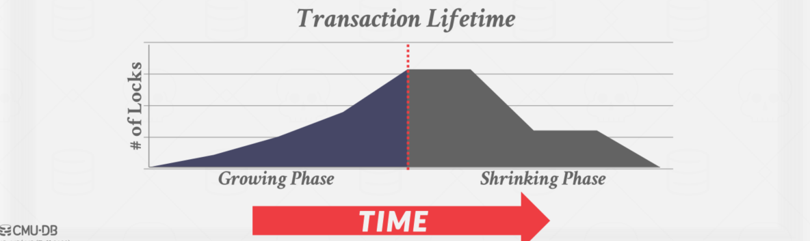
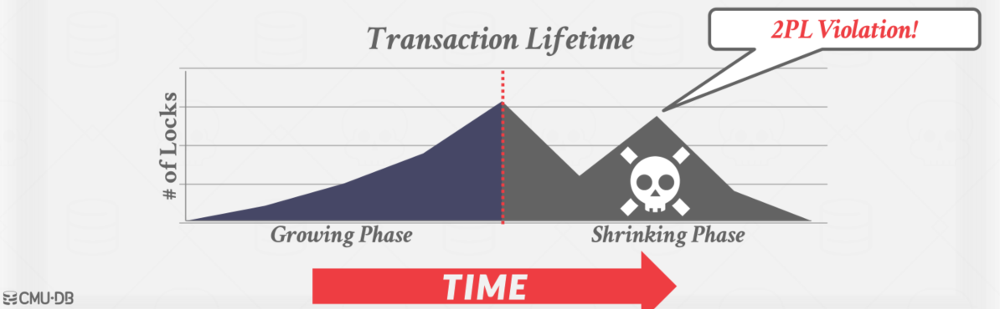
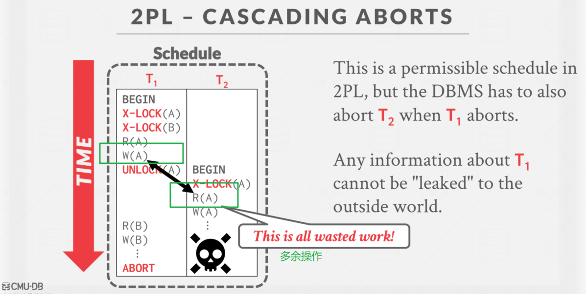
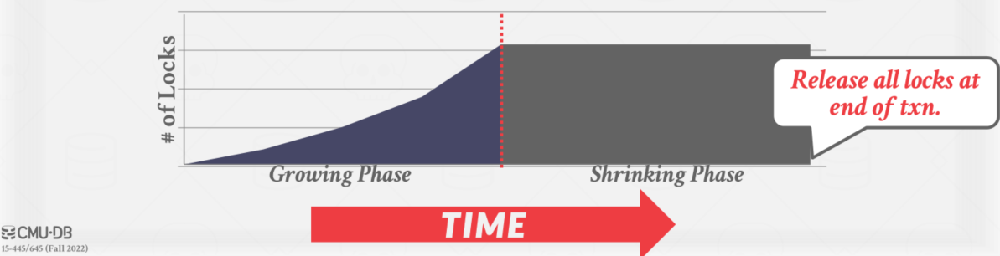

# Two-Phase Locking Concurrency Control

## 概述

我们需要一种方法来保证所有执行计划都是正确的（例如，可串行化的），而不需要提前知道整个计划。

解决方案:使用**锁**保护数据库对象。

## Locks 和 Lathches 的辨析

## 基本锁的类型

持有锁的执行过程

1. 事务请求锁(或升级)。
2. 锁管理器授予或阻塞请求。
3. 事务释放锁。
4. 锁管理器更新其内部锁表，它跟踪哪些事务持有哪些锁，以及哪些事务正在等待获得任何锁。

## 两阶段锁并发控制协议

两阶段锁定(2PL)是一种并发控制协议，它决定 txn 在运行时是否可以访问数据库中的对象。

协议不需要提前知道  txn 将执行的所有查询。

>Phase #1: Growing（增长阶段）
>
>- Each txn requests the locks that it needs from the DBMS’s lock manager. （每个 txn 向 DBMS 的锁管理器请求所需的锁）
>- The lock manager grants/denies lock requests.（锁管理器授予/拒绝锁请求）
>
>Phase #2: Shrinking（收缩阶段）
>
>- The txn is allowed to only release/downgrade locks that it previously acquired. It cannot acquire new locks.（txn只允许释放/降级它以前获得的锁，它不能获得新的锁）

txn 在增长阶段结束后不允许获得/升级锁。

2PL 本身就足以保证冲突的可序列化性，因为它生成的调度的优先级图是非循环的。

但它容易出现**级联回滚**。

### 两阶段锁的观察

有一些可能的计划是可串行化的，但 2PL 不允许，因为锁限制了并发性。

- 大多数 DBMS 更看重正确性而不是性能。

可能还有“脏读”。【上面的这个图，读到了未提交（后面那个事务可能停止）的数据】

- 解决方案：严格两阶段锁，Strong Strict 2PL (aka Rigorous 2PL)

可能会导致死锁。【如两个事务分别申请了A, B锁，接着又申请对方的锁，此时进入死锁状态。】

- 解决方法：检测或预防

### 严格两阶段锁协议

txn 只允许在结束（即提交或中止）后释放锁。

只允许冲突可穿行和化调度，但它通常比某些应用程序需要的更强。

如果 txn 写入的值在 txn 完成之前不被其他 txn 读取或覆盖，则调度是严格的。

优点:

- 不会导致级联中止。
- 终止的 txns 可以通过恢复被修改元组的原始值来恢复。

