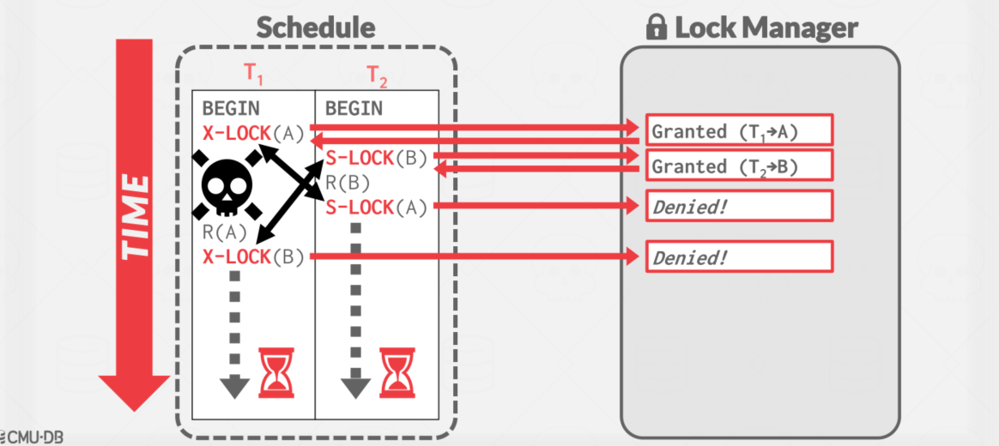

# Two-Phase Locking Concurrency Control

## 两阶段锁

有些概念开始模糊了，来龙去脉开始糊涂了，所以做一下记录。

数据库遵循的是两段锁协议，将事务分成两个阶段，加锁阶段和解锁阶段（所以叫两段锁）

- 加锁阶段：在该阶段可以进行加锁操作。在对任何数据进行读操作之前要申请并获得S锁（共享锁，其它事务可以继续加共享锁，但不能加排它锁），在进行写操作之前要申请并获得X锁（排它锁，其它事务不能再获得任何锁）。加锁不成功，则事务进入等待状态，直到加锁成功才继续执行。
- 解锁阶段：当事务释放了一个封锁以后，事务进入解锁阶段，在该阶段只能进行解锁操作不能再进行加锁操作。

这种方式虽然无法避免死锁，但是两段锁协议可以保证事务的**并发调度是串行化**（串行化很重要，尤其是在数据恢复和备份的时候）的。注意这里的串行化是调度的串行化，等下讲的隔离级别的串行化是指隔离级别。

## 事务的四种隔离级别

在数据库操作中，为了有效保证并发读取数据的正确性，提出的事务隔离级别。我们的数据库锁，也是为了构建这些隔离级别存在的。

| 隔离级别                     | 脏读（Dirty Read） | 不可重复读（NonRepeatable Read） | 幻读（Phantom Read） |
| :--------------------------- | :----------------- | :------------------------------- | :------------------- |
| 未提交读（Read uncommitted） | 可能               | 可能                             | 可能                 |
| 已提交读（Read committed）   | 不可能             | 可能                             | 可能                 |
| 可重复读（Repeatable read）  | 不可能             | 不可能                           | 可能                 |
| 可串行化（Serializable ）    | 不可能             | 不可能                           | 不可能               |

脏读：t1 修改数据，t2 读到，t1 abort，t2读脏数据

不可重复读：t1读数据，t2改数据，t1再读数据，数据不一致

幻读：t1统计行数，t2插入数据，t1再统计行数，t1两次统计的不一样

- 未提交读(Read Uncommitted)：可能读取到其他会话中未提交事务修改的数据
- 已提交读(Read Committed)：只能读取到已经提交的数据。Oracle等多数数据库默认都是该级别 (不重复读)
- 可重复读(Repeated Read)：可重复读。在同一个事务内的查询都是事务开始时刻一致的，InnoDB默认级别。在SQL标准中，该隔离级别消除了不可重复读，但是还存在幻读。
- 串行读(Serializable)：完全串行化的读，每次读都需要获得表级共享锁，读写相互都会阻塞。

## 概述

我们需要一种方法来保证所有执行计划都是正确的（例如，可串行化的），而不需要提前知道整个计划。

解决方案:使用**锁**保护数据库对象。

## Locks 和 Lathches 的辨析

## 基本锁的类型

持有锁的执行过程

1. 事务请求锁(或升级)。
2. 锁管理器授予或阻塞请求。
3. 事务释放锁。
4. 锁管理器更新其内部锁表，它跟踪哪些事务持有哪些锁，以及哪些事务正在等待获得任何锁。

## 两阶段锁并发控制协议

两阶段锁定(2PL)是一种并发控制协议，它决定 txn 在运行时是否可以访问数据库中的对象。

协议不需要提前知道  txn 将执行的所有查询。

>Phase #1: Growing（增长阶段）
>
>- Each txn requests the locks that it needs from the DBMS’s lock manager. （每个 txn 向 DBMS 的锁管理器请求所需的锁）
>- The lock manager grants/denies lock requests.（锁管理器授予/拒绝锁请求）
>
>Phase #2: Shrinking（收缩阶段）
>
>- The txn is allowed to only release/downgrade locks that it previously acquired. It cannot acquire new locks.（txn只允许释放/降级它以前获得的锁，它不能获得新的锁）

txn 在增长阶段结束后不允许获得/升级锁。

2PL 本身就足以保证冲突的可序列化性，因为它生成的调度的优先级图是非循环的。

但它容易出现**级联回滚**。

### 两阶段锁的观察

有一些调度可能是可串行化的，但 2PL 不允许，因为锁限制了并发性。

- 大多数 DBMS 更看重正确性而不是性能。

可能还有“脏读”。【上面的这个图，读到了未提交（后面那个事务可能停止）的数据】

- 解决方案：严格两阶段锁，Strong Strict 2PL (aka Rigorous 2PL)

可能会导致死锁。【如两个事务分别申请了A, B锁，接着又申请对方的锁，此时进入死锁状态。】

- 解决方法：检测或预防

### 严格两阶段锁协议

txn 只允许在结束（即提交或中止）后释放锁。

只允许冲突可穿行和化调度，但它通常比某些应用程序需要的更强。

如果 txn 写入的值在 txn 完成之前不被其他 txn 读取或覆盖，则调度是严格的。

优点:

- 不会导致级联中止。
- 终止的 txns 可以通过恢复被修改元组的原始值来恢复。

### 一个例子

描述

不是两阶段锁

两阶段锁

严格两阶段锁

调度的范围

### 2PL的死锁

即使是严格两阶段锁也没有解决死锁问题。

死锁是等待彼此释放锁的事务循环。

处理死锁的两种方法:

- 方法#1:死锁检测
- 方法#2:死锁预防

## 死锁检测

DBMS 创建一个等待图来跟踪每个 txn 正在等待获取什么锁:

- 节点是事务
- 如果 Ti 正在等待 Tj 释放锁，则从 Ti 到 Tj 有一条边。

系统定期检查等待图中的循环，然后决定如何破坏它。

## 死锁处理

当 DBMS 检测到死锁时，它将选择一个“受害者” txn 进行回滚以打破循环。

受害者 txn 将重新启动或中止(更常见)，这取决于调用它的方式。

在检查死锁的频率和 txns 在死锁被打破之前等待的时间之间存在权衡。太快了，代价太大；太慢了，事务已经卡太久了。

### 受害者的选取

选择合适的受害者取决于很多不同的变量....

- 按年龄(最低时间戳)
- 按进度(执行的查询最少/最多)
- 按已经锁定的项的数量
- 按我们必须回滚的 txns 的数量。
- 我们还应该考虑 txn 在过去重新启动的次数，以防止饥饿。

### 回滚的程度

在选择要中止的受害txn后，DBMS还可以决定回滚txn的更改的程度。

>Approach #1: Completely 
>
>- Rollback entire txn and tell the application it was aborted.(回滚整个txn并告诉应用程序它已中止。)
>
>Approach #2: Partial (Savepoints)
>
>- DBMS rolls back a portion of a txn (to break deadlock) and then attempts to re-execute the undone queries.(DBMS回滚txn的一部分(以打破死锁)，然后尝试重新执行未完成的查询)

## 死锁预防

当一个 txn 试图获取另一个 txn 持有的锁时，DBMS 会终止其中一个以防止死锁，这种方法不需要等待图或检测算法。

根据时间戳分配优先级:→旧的时间戳=更高的优先级(例如，T1 > T2) 

>Wait-Die ("Old Waits for Young"))（“老的等待年轻的”）
>
>- If requesting txn has higher priority than holding txn, then requesting txn waits for holding txn. （如果老的想加锁，此时被年轻的所持有，则等待年轻的）
>- Otherwise requesting txn aborts.（如果年轻的想加锁，发现老的在持有，直接自杀）
>
>Wound-Wait ("Young Waits for Old")（“年轻的等待老的”）
>
>- If requesting txn has higher priority than holding txn, then holding txn aborts and releases lock.（如果老的想加锁，此时被年轻的所持有，直接把锁抢过来，年轻的放弃）
>- Otherwise requesting txn waits.（如果年轻的想加锁，发现老的在持有，等待）

Q：为什么这些方案保证没有死锁?

A：在等待锁时，只允许一种“类型”的方向。（都是老的占据优势地位）

Q：当 txn 重新启动时，它的(新)优先级是什么?（年轻的被abort了，给它新的时间戳还是第一次执行的时间戳）

A：应该给他它最初的时间戳，防止造成饥饿。

## 思考

所有这些示例都具有从数据库对象到锁的一对一映射。

如果 txn 想要更新10亿个元组，那么它必须获得10亿个锁。

获取锁的操作本身就是一个很大的开销，即使锁是可用的。

## 锁的粒度

当 txn 想要获得一个“锁”时，DBMS 可以决定锁的粒度(即范围)。

- 属性，元组，页，表

理想情况下，DBMS 应该获得 txn 所需的最少数量的锁。同时要考虑并行和开销之间的权衡。

- 更少的锁，更大粒度 vs 更多的锁，更小粒度

### 意向锁

意图锁允许**更高层级的节点**以共享或独占模式被锁定，而不必检查所有后代节点。

如果节点以意图模式锁定，则某些 txn 将在树的较低级别执行显式锁定。

>Intention-Shared (IS)
>
>-  Indicates explicit locking at lower level with shared locks.（下面的部件加了S锁，在此部件加上IS）
>
>Intention-Exclusive (IX) 
>
>- Indicates explicit locking at lower level with exclusive locks.（下面的部件加了X锁，在此部件加上IX）
>
>Shared+Intention-Exclusive (SIX) 
>
>- The subtree rooted by that node is locked explicitly in shared mode and explicit locking is being done at a lower level with exclusive-mode locks. （自己加了S，底下的部件加上IX）

### 锁兼容矩阵

### 锁协议

每个 txn 在数据库层次结构的最高级别获得适当的锁。

>To get **S** or **IS** lock on a node, the txn must hold at least **IS** on parent node.（如果想在某个节点加S或者IS锁，需要有父节点的IS锁）
>
>To get **X**, **IX**, or **SIX** on a node, must hold at least **IX** on parent node.（如果想在某个节点加X或者IX锁或者SIX锁，需要有父节点的IX锁）

### 例子

见[PPT，52页-58页](https://15445.courses.cs.cmu.edu/fall2022/slides/16-twophaselocking.pdf)

分层锁在实践中很有用，因为每个 txn 只需要几个锁。

意图锁有助于提高并发性:

- 意图共享锁(IS)：意图以更细的粒度获得S个锁。
- 意图独占锁(IX)：意图以更细的粒度获得X个锁。
- 共享+意图独占锁(SIX)：同时想要S和IX。

### 锁升级

当 txn 获得太多低级别锁时，DBMS 可以自动切换到粗粒度锁。

这减少了锁管理器必须处理的请求数量。

### 实践中

应用程序通常不会手动获取 txn 的锁(即显式SQL命令)。

有时您需要向 DBMS 提供提示，以帮助它提高并发性。

- 读取后更新元组。

显式锁在对数据库进行重大更改时也很有用。

#### 锁表

显式锁定表，不是SQL标准的一部分。

- Postgres/DB2/Oracle 模式：SHARE, EXCLUSIVE
- MySQL模式：READ, WRITE

#### 查询后更新

执行查询，然后在匹配的元组上设置独占锁。也可以设置共享锁:

- Postgres：**FOR SHARE**
- MySQL：**LOCK IN SHARE MODE**

## 结论

几乎每一个 DBMS 都使用 2PL，自动生成正确的交叉执行顺序:

- 锁+协议(2PL, SS2PL…)
- 死锁检测+处理
- 死锁预防

>2PL（2 Phase Locking）, 锁分两阶段，一阶段申请，一阶段释放
>
>S2PL（Strict 2PL），在2PL的基础上，写锁保持到事务结束
>
>SS2PL（ Strong 2PL），在2PL的基础上，读写锁都保持到事务结束

## 下节课

时间戳排序并发控制，Timestamp Ordering Concurrency Control

