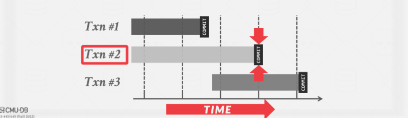

# Timestamp Ordering Concurrency Control

这节课继续讲并发控制的实现。

两阶段锁(2PL)，确定 txns 执行时冲突操作的序列化顺序，悲观的。

时间戳排序(T/O)，确定 txns 执行前的可序列化顺序，乐观的。

## 时间戳并发控制

使用时间戳来确定 txns 的可序列化顺序。

如果 **TS(Ti) < TS(Tj)**，那么 DBMS 必须确保执行计划等价于 Ti 出现在 Tj 之前的串行调度。

## 时间戳分配

每个 txn **Ti** 被分配一个喂一的固定时间戳，该时间戳是单调递增的。

- 设 TS(Ti) 为分配给 txn **Ti** 的时间戳。
- 不同的方案在 txn 期间的不同时间分配时间戳。

多种实现策略

- 系统时钟，可能出现问题， 
- 逻辑计数器。
- 混合使用

## 今天讲什么

1. 基本时间戳排序(T/O)协议

2. 乐观并发控制

>1 和 2 都是基于时间戳的，也是乐观的，只不过是起名问题

隔离级别

## 基本时间戳排序

Txns 读写对象不需要锁。

每个对象 X 都被标记上成功读/写的最后一个 txn 的时间戳:

- W-TS(X) -这个对象上一次被写的写时间戳
- R-TS(X) -这个对象上一次被读的写时间戳

每个操作都要检查一下时间戳：

- 如果 txn 试图从“未来”访问一个对象，它将中止并重新启动。

### 基本时间戳排序读

>If **TS(Ti) < W-TS(X)**, this violates timestamp order of **Ti** with regard to the writer of **X**.（我想要读的被其他的写过了）
>
>- Abort **Ti** and restart it with a new **TS**.（终止掉，并重启给它一个新的时间戳）
>
>Else:
>
>- Allow **Ti** to read **X**.（允许事务读X）
>- Update **R-TS(X)** to **max(R-TS(X), TS(Ti))**（更新X的读时间戳，为这一次的时间戳和之前读时间戳的最大值,因为有可能被更新的事务读过了，ppt的第一个例子）
>- Make a local copy of **X** to ensure repeatable reads for **Ti**.（自己保留一份副本，确保读到的一直都是一个值）

### 基本时间戳排序写

>If **TS(Ti) < R-TS(X)** or **TS(Ti) < W-TS(X)**（想写的被未来的事务已经读过或者写过了）
>
>- Abort and restart **Ti**. （中止掉并重启）
>
>Else:
>
>- Allow **Ti** to write **X** and update **W-TS(X)**（允许事务读X，并更新X的写时间戳）
>- Also make a local copy of **X** to ensure repeatable reads.（也在本地保留一份，确保读到的是一个值）

### 基本时间戳排序的例子

见[PPT，8页-10页]()

这里有一个优化的例子，就是某个对象的 t1 可能会写来自于未来的事务 t2 已经写了的情况。

### Thomas Write规则（一个优化）

>If **TS(Ti) < R-TS(X)**
>
>- Abort and restart **Ti**.（写的对象已经被未来读了，不行）
>
>If **TS(Ti) < W-TS(X)**
>
>- **Thomas Write Rule**: Ignore the write to allow the txn to continue executing without aborting.
>- This violates timestamp order of **Ti**.（反正我写的值也要被未来写的覆盖，我自己骗自己写了，不修改写时间戳）
>
>Else
>
>- Allow **Ti** to write **X** and update **W-TS(X)** （正常）

如果不使用托马斯写规则，则生成可序列化冲突的调度。

- 没有死锁，因为没有消息会等待。
- 如果短 txns 持续引起冲突，长 txns 可能会挨饿。（一个事务100多条语句，自己操作的时候时间戳肯定是小的，都已经被未来修改了，重启之后100多条，那我的时间戳到后面还是小的）

Andy 不知道有任何 DBMS 使用这里描述的基本T/O协议。

- 它提供了OCC / MVCC的构建模块。

### 基本时间戳排序的一个性能问题

将数据复制到 txn 的工作空间和更新时间戳带来的高开销。

- 每次读取都需要 txn 写入数据库。

长时间运行的 txns 会挨饿。

- txn 从更新的 txn 中读取内容的可能性增加。

### 思考

如果您假定 txns 之间的冲突很少，并且大多数 txns 都是短期的，那么强制 txns 获取锁或更新时间戳会增加不必要的开销。

更好的方法是针对无冲突的情况进行优化。

## OCC（Optimistic Concurrency Control）

DBMS为每个 txn 创建一个私有工作区。

- 所有读到的对象都被复制到工作区。
- 修改应用到工作区。

当一个 txn 提交时，DBMS 比较工作区写集，看它是否与其他 txn 冲突。

如果没有冲突，则将写集合安装到“全局”数据库中。（感觉有点像Git）

### OCC阶段

>#1 – Read Phase:
>
>- Track the read/write sets of txns and store their writes in a private workspace.（跟踪 txns 的读/写集，并将其写入存储在私有工作区中）
>
>#2 – Validation Phase:
>
>- When a txn commits, check whether it conflicts with other txns.（当一个txn提交时，检查它是否与其他txn冲突。）
>
>#3 – Write Phase:
>
>- If validation succeeds, apply private changes to database. （如果验证成功，应用私有更改数据库。）
>- Otherwise abort and restart the txn.（否则中止并重新启动txn。）

### OCC的例子

见[PPT，20页]()

PS：

1. 在这个协议下，读时间戳不需要了。
2. 只有在校验阶段才分配时间戳。

### OCC读阶段

跟踪 txns 的读/写集，并将其写入存储在私有工作区中。

DBMS 将 txn 从共享数据库访问的每个元组复制到其工作区，以确保可重复读取，我们现在可以忽略 txn 通过索引读写元组所发生的情况。

### OCC校验阶段

当 txn Ti 调用 COMMIT 时，DBMS 检查它是否与其他 txns 冲突。

- DBMS需要保证只允许序列化调度。
- 检查其他 txns 是否存在 RW 和 WW 冲突，并确保冲突是一个方向的(例如，老的→年轻的)。

方法1：Backward Validation（向后校验）

方法2：Forward Validation（向前校验）

#### OCC的向后校验（向已经提交的那些校验）

检查正在提交的 txn 是否与已经提交的 txn 的读/写集交叉。有冲突自杀。

检验域

#### OCC的向前校验（向未来的那些校验）

检查正在提交的 txn 是否与任何尚未提交的活动 txn 交叉其读/写集。可以选择自杀，也可以选择杀掉别人。

校验域

检查提交的 txn 与所有其他正在运行的 txn 的时间戳顺序。

在向前校验时，若保证【事务没有冲突】TS(Ti) < TS(Tj)，需要考虑三种情况，

#### OCC向前校验不冲突的三种情况

1. 

